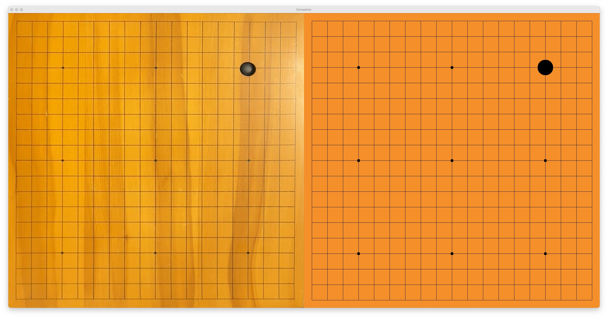

# Goban Watcher


### Prerequisites
> [!NOTE]
> Using KataGo is optional and can be skipped!
> Continue with "Starting the application"

It can happen that multiple moves are picked up at the same time and it is unclear in which order they where played.
To combat this issue [KataGo](https://github.com/lightvector/KataGo) is be used to select the "best" possible variation.
To be able to use KataGo the following steps **must** be taken:

1. Install [KataGo](https://github.com/lightvector/KataGo). Validate if `katago` command works.
2. Install a KataGo model from [here](https://katagotraining.org/networks/). During development a model with the architecture of `b28c512nbt` was used.
    1. Rename the model file to `b28c512nbt.bin.gz`
    2. Move it into `katago/models/`.
    3. Validate from root folder that this command works:
      ```shell
      katago analysis -config "katago/configs/analysis_example.cfg" -model "katago/models/b28c512nbt.bin.gz"
      ```

### Starting the application
The easiest way to get up and running is to use [uv](https://docs.astral.sh/uv/).
start the application with:
```sh
uv run main.py
```
Use `uv run main.py --help` to see all available flags.

### Usage

To be able to use Goban Watcher you need a Camera / Webcam that is connected to your computer or laptop.
Place the camera or webcam as a top-down view. Having it also from the side looking at the board is also fine, but could
lead to issues if the stones are poorly placed.

> [!WARNING]
> The application is still very bear bones and not very usability friendly.
> I hope to improve this in the future. So for now I try to document it as much a possible here.

#### Setup Corners

This is the first and most manual part of the setup. The application does not have an automatic board detection yet.
So you have to setup the corners manually the first times.

> [!Warning]
> Since the setup of the corners is manual and happens at the start of the recording any movement of the board during the game will break the recording!


You will see two windows of which one is called "Default". This window is used to setup the corners.
Press 1-4 on your keyboard to select one corner. It will follow your mouse cursor and you can release it by pressing
the same number or another number.


The "Transformed" window can be used to see if the aligment is correct. Also consider that the final sgf will be the same orientation as the window shows. The recommendation is to start with the top left corner (for the black player) as corner 1 and go clockwise for each corner. The top right corner should be 2 from the view of the black player.


Example how the finished alignment should look like.


Example how the finished "Transformed" window should look like.

#### Saving the corners

Press `s` to save the corner placement. There should be a log message about a successful save in the terminal. The saved corners can be reused by passing the `--use-saved-corners` param after the start commmand. The program will try to read the `backup/corners.json`. A single stone should fit into one of the small squares.

#### Resetting the corners

Press `r` to reset the position of all corners to the default position.

#### Starting Recording

Press `enter` or `return` to start recording. When the real board and digital board are side by side it is recording.
Each move now should be recorded and also the sgf, located in `/recodings`, should be update after each change.
If more than then 3 stones are recognized at the same time it will "edit" the sgf and add all at the same time (if KataGo is disabled).



To stop the recording press `q` or `esc` which will save the game one more time and exit the application.
